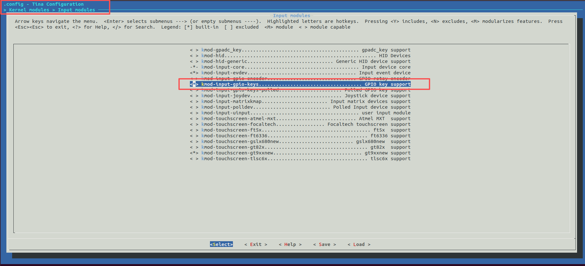

## 1. GPIO_KEY

### 1.1 在 menuconfig 中启用模块

路径：`kernel/input/`

勾选：`kmod-input-gpio-keys`



### 1.2 在board.dts中添加 gpio_keys
```dts
#include <dt-bindings/input/linux-event-codes.h>

    /* 添加到/{}*中 /
	/* 新增：GPIO 按键 key_user */
	gpio_keys: gpio-keys {
		compatible = "gpio-keys";

		/* 如需 pinctrl，请添加:
		   pinctrl-names = "default";
		   pinctrl-0 = <&key_user_pins>;
		*/

		key_user: key_user {
			label = "key_user";              /* /etc/rc.button/key_user 用此名字 */
			linux,code = <KEY_PROG1>;        /* 可改 KEY_RESTART / KEY_WPS_BUTTON 等 */
			gpios = <&pio PG 8 GPIO_ACTIVE_LOW>;  /* 外部上拉，按下为低电平 */
			debounce-interval = <20>;        /* 50ms 去抖，根据需要调整 */
			/* autorepeat;  如果需要长按自动重复事件再取消注释 */
		};
	};


    /* 添加到&pio{}中 */
    key_user_pins: key_user_pins {
		pins = "PG8";
		function = "gpio_in";
		/* 因为外部已有上拉，可以不写 bias-pull-up；如要启用内部上拉则取消注释 */
		/* bias-pull-up; */
	};

```

### 1.3 添加驱动
```bash
insmod /lib/modules/5.4.61/gpio_keys.ko
```

### 1.4 测试脚本
```bash
#!/bin/sh
EVENT=/dev/input/event3
echo "...... $EVENT (Ctrl+C ......)"
while true; do
  # ............ input_event ......
  dd if="$EVENT" bs=24 count=1 2>/dev/null | \
  hexdump -e '16/1 "" 2/2 " %u" 1/4 " %u\n' | while read TYPE CODE VALUE; do
      [ -z "$TYPE" ] && continue
      [ "$TYPE" != "1" ] && continue   # ...... EV_KEY
      case "$VALUE" in
        0) ACT=RELEASE;;
        1) ACT=PRESS;;
        2) ACT=REPEAT;;
        *) ACT="VAL=$VALUE";;
      esac
      echo "KEY code=$CODE $ACT"
  done
done
~
```